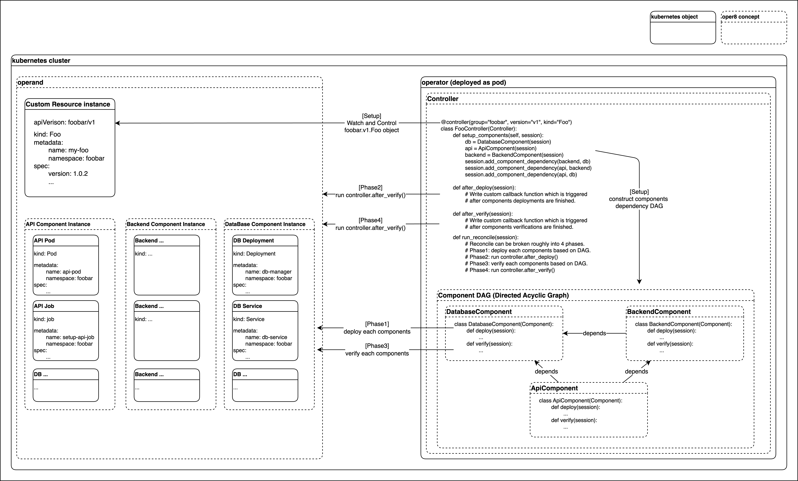

# Architecture

The oper8 architecture is focused on allowing users to implement exactly what their operator needs while making the operator logic "just work" behind the scenes.

## Definitions

- `watch`: The `watch` operation is the binding of specific event handling logic to a `group/version/kind`.

- `reconciliation`: The event handling in the `operator` pattern is referred to as a `reconciliation`. This is because the primary job of an `operator` is to reconcile the current state of the cluster against the desired state declared in the Custom Resource instance (`CR`).

- `apply`: In order to manage dependent resources, an `operator` needs to make changes in the cluster. The `apply` operation takes an in-memory representation of an object and applies that change to the cluster.

- `get`: An `operator` often needs to fetch the current state of a resource from the cluster. The `get` operation fetches this state at the current time.

- `disable`: Depending on configuration values, an `operator` may need to ensure that a given resource does not exist in the cluster. The `disable` checks for a resource and deletes it if found.

- `verify`: In order to understand the state of a given CR instance, an `operator` must be able to verify the current state of its managed resources. In `oper8`, this is done with type-specific logic for most standard kubernetes objects, and simply by checking for the object's presence for all other types.

## Abstractions

<!-- TODO put link to component class -->

### `Session`

A `Session` contains the state of the current reconciliation (1 `Session` == 1 reconciliation). A `Session` is shared across all related objects which associate with the same reconciliation. For instance, users can implement a `controller` method which get some `component` status, and then use that information to modify other `component` by leveraging a `session`. `Session` also serves as a gateway to use `DeployManager` which `get` or `set` objects inside of the k8s cluster.

### `DeployManager`

`DeployManager` module implements an abstraction around `apply`, `get` and `disable` operations (Similar to `kubectl apply`). It is accessible via `Session` in all user implementation.

### `WatchManager`

A `WatchManager` module implements an abstract interface for regstering `Controllers` as reconciliation event listeners via `watch` operation. In general, users do not need to interact with this abstraction outside of invoking `oper8` as a `__main__` module with `--dry_run`.

### `Component`

A `Component` is an atomic grouping of raw `kubernetes` resources that serves a single purpose. For instance, a standard microservice will consist of a `Deployment`, a `Secret` and a `Service`. These would all be grouped into a single `Component` as creating any of them in isolation would not make sense.

### `Controller`

A `Controller` is the core object type that manges the mapping from a CR instance to the set of `Component`. A `Controller` is bound to **exactly one CR** by specifying `group/version/kind`, and define associated `Component(s)`. A `Controller` performs `reconciliation` when the corresponding `watch` event is triggered.

## Reconciliation overview

The `reconcile` entry point is `Controller.run_reconcile()` which then triggers the following steps in high level:

1. **[Setup] Construct The Session**: Set up the immutable `Session` object that will be passed through the rest of the rollout
2. **[Setup] Construct the [session dependency DAG (Directed acyclic graph)](session_dependency_graph.md) based on components dependencies**: User defined components described in `Controller.setup_components()` and `Session.add_component_dependency()` are in the end converted into DAG so that `oper8` can deploy them from upstream components.
3. **[Phase1] Run the `Component.deploy()` in DAG**: In dependency order, invoke `deploy` on each `Component`, halting if any `Component` terminates with an unsuccessful state. This may be caused by an expected error (prerequisite resource not found in the cluster), or an unexpected error (unstable cluster).
4. **[Phase2] Run user defined `Controller.after_deploy()` or `Controller.after_deploy_unsuccessful()`**: User-defined `Controllers` may define custom logic to run after the `deploy` DAG has completed successfully, but before the `verify` DAG runs. Note this is not one component level like `Component.deploy()`. This runs after all components deployments are finished.
5. **[Phase3] Run the `Component.verify()` in DAG**: The deployed components from `Phase2` are verified per component in accordance with the dependency order of the DAG. User can customize verification logic for each component using the `Component.verify()` function.
6. **[Phase4] Run user defined `Controller.after_verify()` or `Controller.after_verify_unsuccessful()`**: User-defined `Controllers` may define custom logic to run after all components verify DAG is completed. This is primarily useful for custom readiness checks that requires the entire application to be ready.

## Typical Development Flow

In short, a typical development flow with `oper8` are the following:

First, conceptualize your CR and related k8s resources into oper8 abstractions.

- What is your main CR?
- What k8s resources your CR needs? How they can be grouped as `Component`?
- What are the dependency relationships between each `components`?
- What kind of reconciliation logic you need for the CR?

Then, implement your application with `oper8`.

Typically, user defines `Components` and a `Controller` for the target CR. Then use the `session` with `component` or `controller` to get/set k8s objects in the cluster and use it to customize `reconciliation` logic.

The user rarely need to modify `WatchManager` or `DeployManager`.
