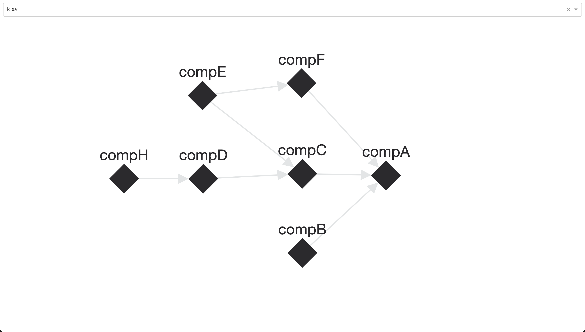

# Session Dependency Graph

Oper8 creates a session dependency graph based on component dependencies to determine the correct deployment order.  
This page explains how to log the generated graph at runtime and how to visualize it using the provided debug script.  
For the overall system architecture, please refer to [the architecture page](architecture.md).

## Log session dependency graph

> The debug log feature is available with [v0.1.34](https://github.com/IBM/oper8/releases/tag/v0.1.34) or higher.

To log the session dependency graph, set the log level to `debug3` or `debug4`. Once enabled, the controller log will include a string representation of the session dependency graph.

```bash
2025-07-23T06:29:35.564320 [CTRLR:DBG3:xxx]     Session dependency DAG: Graph({compA:[],compB:[compA],compC:[compA],compD:[compC],compE:[compC,compF],compF:[compA]})
```

## Visualize session dependency graph

You can also visualize the graph for easier inspection. First, save the session graph string into a text file (i.e. `scripts/session_dependency_graph.txt`). Then run the following command to start a local server that renders the graph as an interactive HTML page at http://127.0.0.1:8050.

If you would like to customize the visualization, refer to the `scripts/create_session_dependency_graph.py` script.

```bash
❯ tox -e graph -- --oper8-graph-path=scripts/session_dependency_graph.txt
...
 * Running on http://127.0.0.1:8050
```


