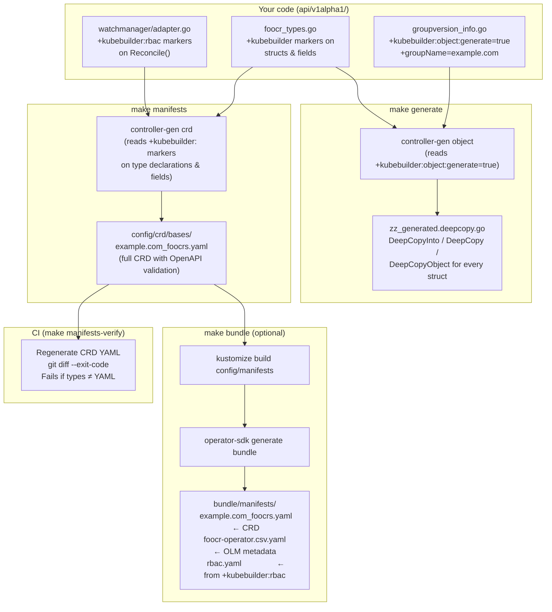

# Codegen in oper8-go

oper8-go uses **`controller-gen`** to eliminate boilerplate. You annotate your Go structs with structured comments (`+kubebuilder:…` markers), run one `make` command, and the tool produces two artefacts:

1. **`zz_generated.deepcopy.go`** — `DeepCopy` methods required by the Kubernetes runtime.
2. **`config/crd/bases/<group>_<plural>.yaml`** — the `CustomResourceDefinition` applied to the cluster.

Neither file is written by hand. Both are committed to git and kept in sync by CI.

---

## Pipeline



---

## The two Makefile targets you use day-to-day

### `make generate`

```bash
make generate
```

Runs:

```
controller-gen object:headerFile="hack/boilerplate.go.txt" paths="./..."
```

**When to run:** any time you add, remove, or rename a field on a struct inside `api/`. The `DeepCopy` methods must stay in sync with the struct layout.

**What it reads:** the package-level marker in [`groupversion_info.go`](../api/v1alpha1/groupversion_info.go):

```go
// +kubebuilder:object:generate=true
package v1alpha1
```

**What it produces:** [`zz_generated.deepcopy.go`](../api/v1alpha1/zz_generated.deepcopy.go).
For every struct it generates a `DeepCopyInto` that copies scalars by value and allocates new slices/maps for reference types:

```go
// Generated — do not edit.
func (in *FooCRStatus) DeepCopyInto(out *FooCRStatus) {
    *out = *in
    if in.Conditions != nil {
        in, out := &in.Conditions, &out.Conditions
        *out = make([]metav1.Condition, len(*in))
        copy(*out, *in)
    }
}
```

---

### `make manifests`

```bash
make manifests
```

Runs:

```
controller-gen crd paths="./api/..." \
    output:crd:artifacts:config=config/crd/bases
```

**When to run:** any time you change a type declaration, add a validation rule, or update a print column.

**What it reads:** markers on type declarations and fields in [`foocr_types.go`](../api/v1alpha1/foocr_types.go).

---

## Marker reference

### On the type declaration

```go
// +kubebuilder:object:root=true
// +kubebuilder:subresource:status
// +kubebuilder:resource:scope=Namespaced,shortName=foo
// +kubebuilder:printcolumn:name="Version",type=string,JSONPath=`.spec.version`
// +kubebuilder:printcolumn:name="Ready",type=string,JSONPath=`.status.conditions[?(@.type=="Ready")].status`
type FooCR struct { … }
```

| Marker                                                 | Effect in the CRD                                                                                                                             |
| ------------------------------------------------------ | --------------------------------------------------------------------------------------------------------------------------------------------- |
| `+kubebuilder:object:root=true`                        | Marks this struct as a top-level CR (not an embedded helper struct)                                                                           |
| `+kubebuilder:subresource:status`                      | Registers `status` as a subresource — `kubectl` and the API server update it independently from `spec`, preventing accidental spec overwrites |
| `+kubebuilder:resource:scope=Namespaced,shortName=foo` | Sets CR scope; `shortName` enables `kubectl get foo`                                                                                          |
| `+kubebuilder:printcolumn:…`                           | Adds columns to `kubectl get foocrs` — no YAML config required                                                                                |

### On fields

```go
// +kubebuilder:validation:MinLength=1
Version string `json:"version"`

// +kubebuilder:validation:Minimum=1
// +kubebuilder:validation:Maximum=10
// +kubebuilder:default=1
Replicas int32 `json:"replicas,omitempty"`
```

| Marker                                             | Effect                                                           |
| -------------------------------------------------- | ---------------------------------------------------------------- |
| `+kubebuilder:validation:MinLength=1`              | API server rejects `version: ""` before the controller is called |
| `+kubebuilder:validation:Minimum=1` / `Maximum=10` | Numeric range enforced at admission time                         |
| `+kubebuilder:default=1`                           | `replicas` defaults to `1` if omitted from the manifest          |

### On the Reconcile method (RBAC)

```go
// +kubebuilder:rbac:groups=example.com,resources=foocrs,verbs=get;list;watch;create;update;patch;delete
// +kubebuilder:rbac:groups=coordination.k8s.io,resources=leases,verbs=get;list;watch;create;update;patch;delete
func (a *Adapter) Reconcile(…) (reconcile.Result, error) { … }
```

These live in [`watchmanager/adapter.go`](../watchmanager/adapter.go) because the RBAC describes what the _controller process_ needs, not what the _CR schema_ looks like. `controller-gen` extracts them into `config/rbac/role.yaml` and `make bundle` embeds them in the OLM CSV.

---

## Keeping generated files in sync (CI)

```makefile
manifests-verify: manifests
    git diff --exit-code config/crd/
```

The CI job runs `make manifests-verify`. It regenerates the CRD YAML and then checks `git diff`. If the types have been changed without re-running `make manifests`, the diff is non-empty and the job fails. This guarantees the CRD YAML in the repo always matches the Go structs.

---

## OLM bundle (`make bundle`)

`make bundle` is an optional step that wraps the CRD output into an [OperatorHub](https://operatorhub.io)-compatible bundle:

```bash
make bundle            # generate bundle under bundle/
make bundle-build      # docker build -t bundle:0.0.1 .
make bundle-push       # docker push bundle:0.0.1
```

The bundle directory structure produced:

```
bundle/
├── manifests/
│   ├── example.com_foocrs.yaml              ← CRD (from make manifests)
│   ├── foocr-operator.clusterserviceversion.yaml  ← OLM metadata (generated)
│   └── foocr-operator_rbac.yaml             ← RBAC (from +kubebuilder:rbac markers)
├── metadata/
│   └── annotations.yaml                     ← OLM channel config
└── Dockerfile                               ← bundle image
```

The CSV (ClusterServiceVersion) is the OLM metadata document. After generation it has placeholder fields (`spec.displayName`, `spec.description`, `spec.icon`, etc.) that must be filled in manually before OperatorHub submission.

---

## Quick-start: adding a new field

1. Edit `api/v1alpha1/foocr_types.go` — add the field with the appropriate JSON tag and `+kubebuilder:` markers.
2. Run `make generate` — regenerates `DeepCopy` methods.
3. Run `make manifests` — regenerates the CRD YAML.
4. Commit all three files together: `foocr_types.go`, `zz_generated.deepcopy.go`, `config/crd/bases/example.com_foocrs.yaml`.

Never edit `zz_generated.deepcopy.go` or the CRD YAML directly. Both will be overwritten on the next `make generate` / `make manifests` run.
